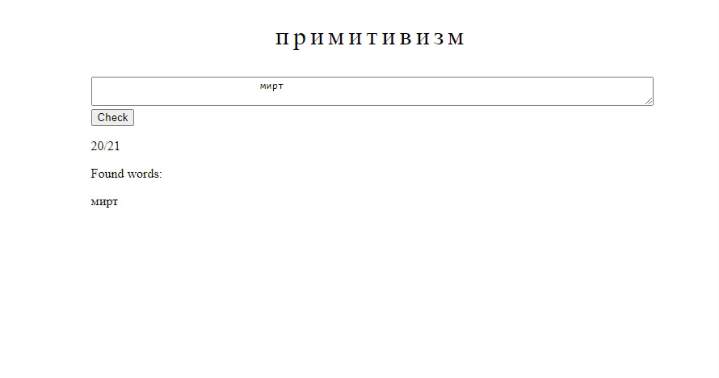

# What is this?
This is a Python package designed for creating linguistic games such as "wordle" or "word jumbler" using user-supplied data. The output is an HTML file that contains the entire game logic, which can be easily hosted on any server (*e.g.* GitHub Pages).

Our mission is to provide a tool that empowers linguistic activists to leverage their knowledge and resources in supporting minority languages. By offering a user-friendly *less-code* package, we aim to enable more people to easily create engaging linguistic games and foster language retention and revitalization efforts.

# Installation
### Via pip install
Our package is available at the Python Package Index

```
pip install word_games
```
### Download repo
You can also directly download this repository and use it in your project
Run:
```
git clone https://github.com/LingConLab/word_games/tree/main
```
And then:
```
cd word_games
pip install -r requirements.txt
```

Inside `./word_games` there will be `games.py` file from where all the games can be accessed and `./templates` folder where html templates stored. They could be edited (if you want to change appearance of your resulted web page for example) but remember not to change `id`'s of html elements without changing them in python code accordingly.
# Usage
## Input files
As soon as our primary aim is to provide language activists with simple solution for creating web games, feel free to use your own language data. For now only two types of data are supported: dictionaries and alphabets.
#### Dictionary
Dictionary file should has `.csv` extention and look like so:
```
should
call
world
over
school
still
try
in
as
last
```
These words will be used then in your game.
*Note: it's better to use `utf-8` as encoding for your data*
#### Alphabet
Alphabet file is currently used in **Wordle** game to define keyboard layout. It should also be `.csv` and look like this:
```
qwertyuiop,
asdfghjkl,
zxcvbnm
```
where each row corresponds to the in-game keyboard row:

## Templates
In our project we extensively use `jinja2` templates and `brython` module to marry users data with game logic. Templates are stored in `./templates` folder and normally there are no need to do anything related to them as a user. Even though you can alter game's and web page's code for your own purposes.
## Using from python file
Our package utilizes *less-code* ideology so there are minimal programming knowledge required to use it.

- Firstly, create your *dictionary* and *alphabet* (if you are going to create wordle) .csv files.
You may want your directory structure to look like this:
```
your_project/
├── dictionary.csv
├── alphabet.csv
├── main.py
└── word_games/
	├── games.py
	├── templates/
```

- Second step is to put in your `main.py` file some code to actually create your game
For example, let's create Wordle. It requires a dictionary and a keyboard files, size of hidden words and, therefore, of all words that can be entered, number of tries player will have in game, direction of writing system of the game's language and finally some alerts texts. So your `main.py` file will look like this:

```python
from word_games.games import wordle

wordle(dictionary="dictionary.csv", size=5, tries=6,
	   alphabet="alphabet.csv", direction="left_to_right",
       nothing_to_delete_error="Seems, you have nothing to delete",
       no_word_in_dictionary_error="There is no word to delete",
       word_is_too_short_error="Hidden word is longer",
       word_is_too_long_error="Hidden word is shorter",
       victory_outcome="You have successfully guessed. Reload the page to try again",
       lose_outcome="You failed to guess the hidden word. Reload the page to try again")
```

- As you run this `main.py` file this function will create a html file `wordle.html` so your directory will look like this:
```
your_project/
├── dictionary.csv
├── alphabet.csv
├── main.py
├── wordle.html
└── word_games/
	├── games.py
	├── templates/
```
This html is good to go and can be run at any server **(don't forget to upload your `dictionary` and `alphabet` with this html! It won't work without it!)**
## Debugging and running locally
If you want to debug or just check what have you created you can run it locally. There are several ways to do so:
1. The easiest way if you are using VS Code will be to:
	1. Install [Live Server](https://marketplace.visualstudio.com/items?itemName=ritwickdey.LiveServer) extension
	2. Go to your project directory
	3. Open the `.html` file you've got as a result
	4. Hit the "Go Live" button in the bottom-right corner
	5. Now you have a local server with your game running (`http://127.0.0.1:5500/` here by default)

2. A little bit more effort way to run it without extensions
	1. Install `flask` using `pip install flask`
	2. Create `app.py` file that should look similar to this:
```python
from flask import Flask

app = Flask(name)

html = open('wordle.html', 'r', encoding="utf-8").read()

@app.route("/")
def hello_world():
    return html

app.run(debug = True)
```

Make sure you are putting correct path to your `.html` file in th `open()` statement. Now you can run `app.py` and this will also create a local server with your game running (`http://127.0.0.1:5500/` here by default).

3. Via GitHub Pages
	1. Upload your `.html` file to your GitHub repository
	2. Rename it to `index.html`
	3. Create a deployment in your repo settings
## Currently available games and examples
### Wordle
*примеры и гифки*
### Combiner
